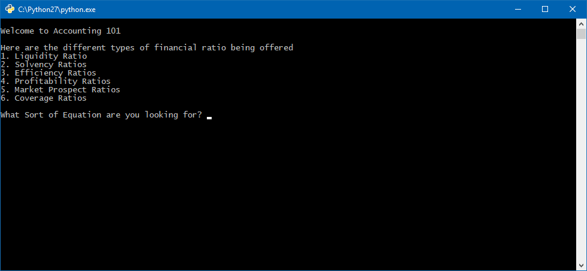

# Python-Solutions
Financial Ratios

This program has been built to be a centralised knowledge bank, holding all of the various business financial ratios. Using this program it is then possible to select a ratio to have it calculated automatically.

The program was written in Python and saved as an executable (.EXE) to work on various machines.

